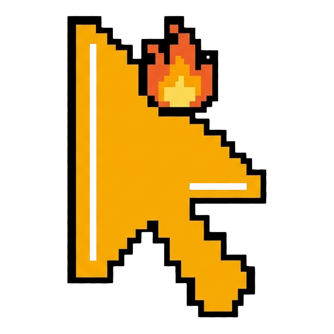

# AngryMouse

[MIT License](https://mit-license.org/)

<p align="center">
  
</p>

**AngryMouse** 是一个轻量 Windows 小工具，把 macOS 风格的“晃动鼠标放大光标”带到 Windows。

## 衍生版本说明（Fork）

本仓库是基于 [Jamir-boop/AngryMouse](https://github.com/Jamir-boop/AngryMouse) 原项目的衍生 Fork，由 **cyx012113** 维护。

- **原始项目**：https://github.com/Jamir-boop/AngryMouse
- **维护者**：cyx012113
- **许可证**：MIT（与原始项目一致）
- **当前版本**：2.12.1（Fork）

_本 Fork 以上游 2.9.5 为基线，已同步合并上游 2.10.0 – 2.12.1 的修复，并保留/增强了 Fork 特有功能。_

## 2.12.1（Fork）新增与变更

### 已同步的上游修复（2.10.0 – 2.12.1）

- 启动钩子顺序修正（覆盖层在钩子之后初始化，避免启动崩溃）
- 快捷键录制可靠性提升、线程安全加固
- 光标热点（hotspot）对齐修正
- 崩溃日志、DPI 自适应、磁盘缓存、设置可移植性
- Double Ctrl 激活、Hold / Toggle 模式、Windows 键守卫、AltGr、会话恢复

### Fork 保留 / 新增功能

- **晃动变大（KDE 风格）**：光标持续放大直到达到最大尺寸（而非跳变到固定尺寸），可配置放大速率与最大尺寸
- **编辑鼠标贴图焦点（热点）**：`CursorRoleAdjustWindow` 提供 DPI 感知的热点编辑器，并新增「自动识别焦点」按钮
- **xfce4 / DMZ / Nord 风格鼠标贴图套建**：程序化绘制 14 种角色，套建自带经解析计算的最优焦点偏移（`cursor-settings.txt`）
- **智能贴图焦点识别（跨语言 AI）**：通过 Python（OpenCV / numpy / Pillow）进程调用分析光标 PNG，
  推断点击热点；已知角色采用标准约定表（权威来源），未知角色回退几何法；无 Python 时自动回退 C# 启发式
- **多目标 .NET 打包**：同时面向 `net472 / net6.0-windows / net8.0-windows / net10.0-windows` 四个框架构建

## 构建与打包（多 .NET 版本）

需要 [.NET 10 SDK](https://dotnet.microsoft.com/download)（可向下构建 net6/net8；net472 需要 .NET Framework 4.7.2 目标包）。

```powershell
# 方式一：直接用脚本打包四个框架（输出到 dist/）
powershell -ExecutionPolicy Bypass -File Tools/Packaging/pack.ps1

# 方式二：手动发布某个框架
dotnet publish AngryMouse/AngryMouse.csproj -c Release -f net8.0-windows -o dist/net8
```

每个框架产出一个独立 zip：`AngryMouse-2.12.1-<tfm>.zip`。

- `net472`：需要系统已安装 .NET Framework 4.7.2+
- `net6 / net8 / net10`：框架依赖发布，需要对应 .NET 运行时；如需免运行时可加 `-SelfContained` 参数发布自包含版本

## 光标套建（Cursor Collections）

`AngryMouse/Resources/CursorCollections/` 下内置 4 套：

- **Adwaita**（上游原带）
- **Xfce4 / DMZ / Nord**（Fork 新增，程序化绘制）

每套的 `cursor-settings.txt` 记录各角色热点偏移，应用首次启动时会复制到用户数据目录
（`%APPDATA%/AngryMouse/CursorCollections/`），使套建自带的正确焦点位置生效。

## 智能热点识别

`Tools/HotspotDetector/hotspot_detector.py` 为检测器本体；C# 侧 `AngryMouse/HotspotDetection/HotspotDetectionService.cs`
通过子进程调用它（`--role <角色键> --target-height 254`）。

- 已知角色（arrow / hand / ibeam / wait / crosshair / size\* / no / help / uparrow / appstarting 等）：
  采用标准约定热点，与生成器的解析几何真值一致（254 空间误差 0px）
- 未知角色：凸包最薄顶点（尖端）+ 局部质心精修的几何回退
- 无 Python 环境：`HotspotDetectionService` 回退到内置 C# 启发式（质心 / 包围盒角）

可用 `Tools/HotspotDetector/validate.py` 做一致性自测（检测器 vs 生成器几何真值）。

## 许可证

本项目基于 MIT 许可证发布，详见原始项目。
